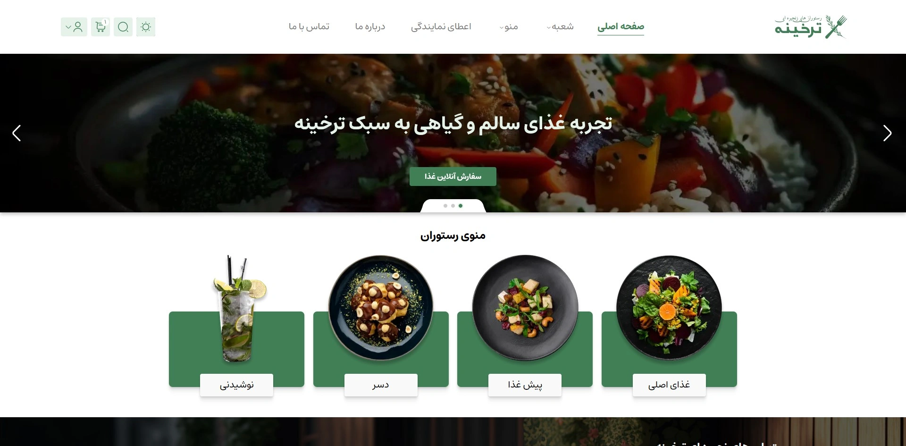
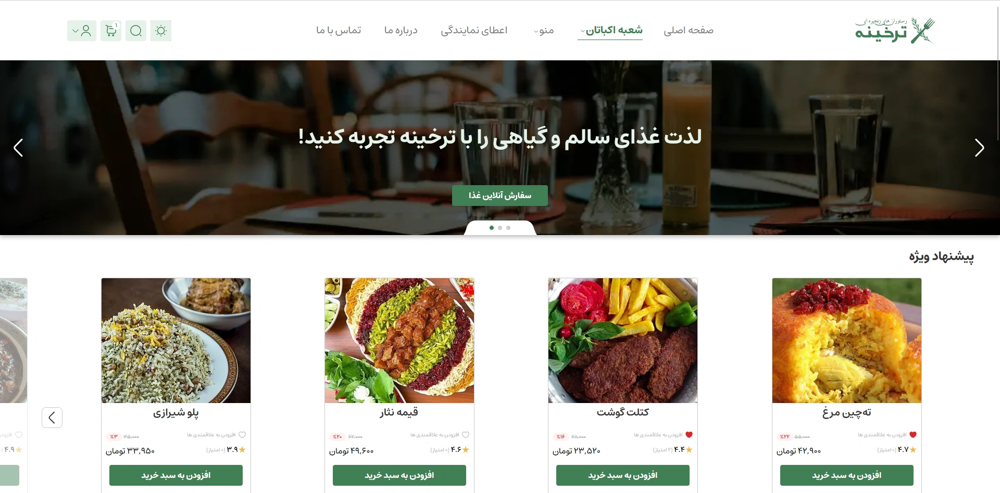

<div dir="rtl">

# 🍞 پروژه ترخینه

ترخینه یک وب‌سایت سفارش غذای سنتی ایرانی است که با Next.js ساخته شده. 🍽️

کاربران می‌تونن غذاهای سنتی ایرانی رو به‌صورت آنلاین مشاهده، جستجو و سفارش بدن. این پروژه یک اپلیکیشن کامل وب رو نشون می‌ده که شامل رابط کاربری ریسپانسیو، کامپوننت‌های تعاملی، احراز هویت، و مسیرهای API سمت سرور برای مدیریت داده‌ها و درخواست‌های کاربران هست. 🚀

## 🖥️ نسخه نمایشی

می‌تونی نسخه زنده پروژه رو از این لینک ببینی:  
**[🔗 مشاهده دمو](https://tarkhineh-1307.vercel.app)**

## 🖼️ پیش‌نمایش پروژه

<p align="center">
  
  
  
</p>

## 🛠️ تکنولوژی‌های استفاده‌شده

🍞 **Next.js (App Router)**  
🎨 **Tailwind CSS**  
🖼️ **SVGR**  
📱 **shadcn/ui**  
📡 **React Query**  
🍃 **MongoDB**  
🔐 **NextAuth.js**  
📃 **Prisma**  
✏️ **Zod**  
📄 **react-hook-form**

## ✨ ویژگی‌ها

🌙 **حالت تاریک**  
پشتیبانی از حالت تاریک با تغییر تم روان.

🌀 **اسکرول بی‌نهایت**  
بارگذاری محتوا به‌صورت پویا هنگام اسکرول صفحه.

📦 **مدیریت محتوای پویا**  
مدیریت محتوا بر اساس تعاملات کاربر.

📱 **طراحی موبایل فرست**  
کاملاً ریسپانسیو و بهینه‌شده برای موبایل.

🍔 **منوی موبایل تعاملی**  
منوی آکاردئونی برای موبایل با استفاده از shadcn/ui.

👤 **احراز هویت با NextAuth.js**  
ورود امن با گوگل و ورود با ایمیل و رمز عبور.

🎨 **رابط کاربری شخصی‌سازی‌شده**  
تجربه کاربری قابل تنظیم با کامپوننت‌ها و لایه‌های انعطاف‌پذیر.

## 🛠️ شروع به کار

### 📦 پیش‌نیازها

⚙️ Node.js (نسخه ۱۶ یا بالاتر)  
💻 Yarn یا npm

### 📥 نصب

1. مخزن رو کلون کن:

   ```bash
   git clone https://github.com/yousef-yaghoubi/tarkhineh.git
   cd tarkhineh
   ```

2. وابستگی‌ها رو نصب کن:

   ```bash
   npm install
   ```

3. کلاینت Prisma رو بساز:

   ```bash
   npx prisma generate
   ```

4. سرور توسعه رو اجرا کن:

   ```bash
   npm run dev
   ```

5. اپ رو در مرورگر باز کن:  
   `http://localhost:3000` 🌍

### 🔐 متغیرهای محیطی

یک فایل `.env` در روت پروژه ایجاد کن و متغیرهای زیر رو اضافه کن:

```env
NEXTAUTH_SECRET=your-secret-key
AUTH_GOOGLE_ID=your-google-client-id
AUTH_GOOGLE_SECRET=your-google-client-secret
HASH_PASS_SECRET=your-password-hash-secret
NEXTAUTH_URL=http://localhost:3000
DATABASE_URL=mongodb+srv://<username>:<password>@cluster0.mongodb.net/tarkhineh
```

## 🤝 مشارکت

خوشحال می‌شم پروژه رو فورک کنی و pull request بزنی. اگه پیشنهادی یا بهبودی داشتی، یه issue باز کن تا بررسیش کنم! 💡

## 📝 لایسنس

این پروژه تحت لایسنس **MIT** منتشر شده. 🔒

## 🎨 طراحی Figma

🖌️ می‌تونی طراحی UI/UX این پروژه رو در فایل فیگما ببینی:  
**[🔗 مشاهده فایل Figma](https://www.figma.com/design/RSeAI35Xm1iwISm7cxU3zn/Tarkhineh-%7C-Food-ordering-Website-%26-Application-(Community))**

</div>
