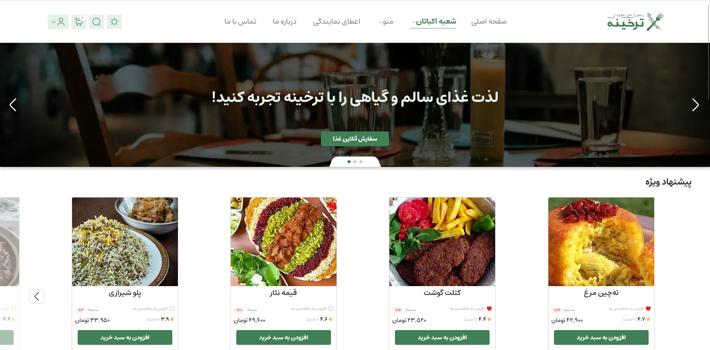
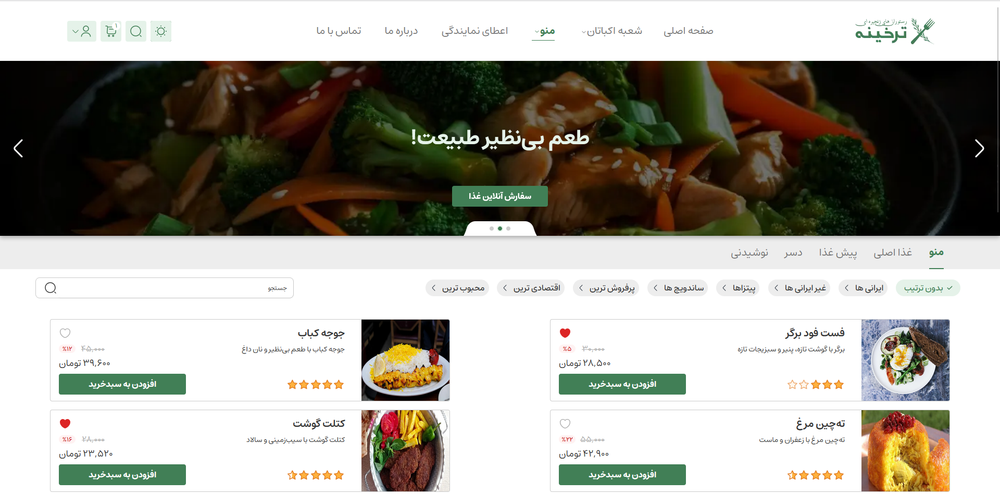

# 🍞Tarkhineh Project

Tarkhineh is a personal project built with Next.js. It focuses on dynamic content loading, infinite scroll, and responsive design. 🚀

## 🖥️Demo 

Check out the live demo here:  
**[🔗 View Demo](https://your-demo-link.com)**


## 🖼️Project Preview


<p align="center">
  
  
  
</p>


## 🛠️Technologies Used 

🍞 **Next.js**: A React framework for building modern web applications with SSR (Server-Side Rendering) and Static Site Generation. ⚡  
🖼️ **SVGR**: Converts SVG files into React components for better scalability and customization.  
📱 **shadcn/ui**: A UI library for implementing mobile menus with accordion functionality.

## ✨Features

🌙 **Dark Mode**  
Support for dark mode UI with smooth theme transitions.

🌀 **Infinite Scroll**  
Seamless content loading as you scroll down the page.

📦 **Dynamic Content Handling**  
Manage content dynamically based on user interactions.

📱 **Mobile-First Design**  
Fully responsive design optimized for mobile devices.

🍔 **Interactive Mobile Menu**  
Accordion-style mobile menu using shadcn/ui.

🎨 **Custom UI**  
Personalized user experience with flexible components and layouts.

## 🛠️Getting Started

### 📦Prerequisites 

⚙️ Node.js (v16 or higher)  
💻 Yarn or npm

### 📥Installation 

1. Clone the repository:

   ```bash
   git clone https://github.com/yousef-yaghoubi/tarkhineh.git
   cd tarkhineh
   ```

2. Install dependencies:

   ```bash
   yarn install
   # or
   npm install
   ```

3. Start the development server:

   ```bash
   yarn dev
   # or
   npm run dev
   ```

4. Open the application in your browser:  
   `http://localhost:3000` 🌍

## 🤝Contribution 

Feel free to fork the project and submit pull requests. If you have any suggestions or improvements, open an issue and we’ll take a look! 💡

## 📝License

This project is licensed under the **MIT License**. 🔒

## 🎨Figma Design 

🖌️ You can view the UI/UX design of this project on Figma:  
**[🔗 View Figma File](https://www.figma.com/design/RSeAI35Xm1iwISm7cxU3zn/Tarkhineh-%7C-Food-ordering-Website-%26-Application-(Community))**

